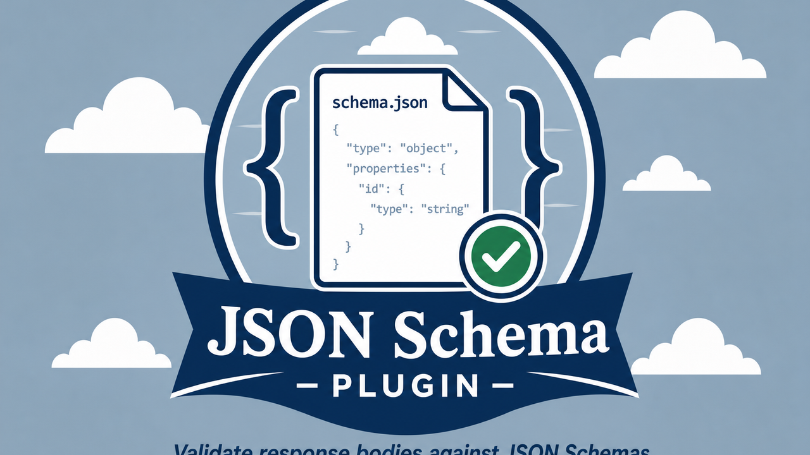

# HarborClient JSON Schema Validator Plugin

Attach JSON Schemas to requests and validate response bodies against them with path-level error details.




## Features

- **JSON Schemas sidebar** — manage a library of named schemas with add, edit, and delete
- **JSON Schema request tab** — pick which schema applies to the current request
- **JSON Validation response tab** — pass/fail result with path-level Ajv errors

## Install

```bash
pnpm install
pnpm build
```

In HarborClient: **Settings → Plugins → Load unpacked…** and select this directory.

## Development

```bash
pnpm dev
```

Rebuilds `dist/renderer.js` on change when HarborClient file watching is enabled for unpacked plugins.

## Limitations

| Aspect              | Behavior                                                                  |
| ------------------- | ------------------------------------------------------------------------- |
| Request association | Keyed by method + URL (no stable saved-request id in the SDK tab context) |
| Response body       | Validates raw response text; must parse as JSON                           |
| Scripts / variables | Pre/post scripts do not transform the validated body                      |
| Schema dialect      | Ajv draft-07 with common string formats via `ajv-formats`                 |

## License

MIT
